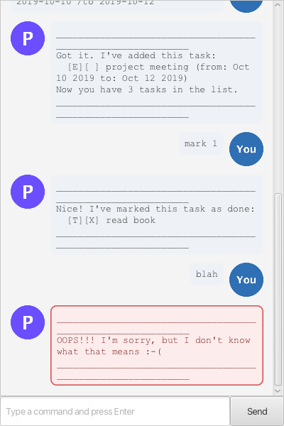

# Percy User Guide



Percy is a friendly desktop chatbot that helps you keep track of your to-dos, deadlines, and events —
by typing simple, one-line commands. It's fast, distraction-free, and remembers your list between sessions.

## Quick start

1. Make sure you have **Java 25** installed.
2. Download the latest `percy.jar` from the [releases page](https://github.com/FatDino789/ip/releases).
3. Copy it into an empty folder (Percy stores its data next to the jar).
4. Open a terminal in that folder and run:
   ```
   java -jar percy.jar
   ```
5. A chat window opens. Type a command into the box at the bottom and press Enter (or click **Send**).

Tasks are saved automatically after every change, so you can just close the window and reopen it later —
everything will still be there.

## Features

> 💡 **Notes on the command format**
> - Words in `UPPER_CASE` are parameters you supply, e.g. in `todo DESCRIPTION`, `DESCRIPTION` is up to you.
> - Task numbers are the numbers shown by `list` (1, 2, 3, ...), not array indices.
> - Dates are always typed as `yyyy-mm-dd`, e.g. `2019-10-15`.
> - Mistakes never crash Percy — you'll get a message starting with `OOPS!!!` explaining what went wrong
>   (shown in a red bubble in the GUI), and you can just try again.

### Adding a to-do: `todo`

Adds a simple task with no date attached.

Format: `todo DESCRIPTION`

Example: `todo read book`
```
Got it. I've added this task:
  [T][ ] read book
Now you have 1 tasks in the list.
```

### Adding a deadline: `deadline`

Adds a task that needs to be done by a specific date.

Format: `deadline DESCRIPTION /by DATE`

Example: `deadline submit report /by 2019-12-01`
```
Got it. I've added this task:
  [D][ ] submit report (by: Dec 01 2019)
Now you have 2 tasks in the list.
```

### Adding an event: `event`

Adds a task that spans a start and end date.

Format: `event DESCRIPTION /from DATE /to DATE`

Example: `event team offsite /from 2019-10-10 /to 2019-10-12`
```
Got it. I've added this task:
  [E][ ] team offsite (from: Oct 10 2019 to: Oct 12 2019)
Now you have 3 tasks in the list.
```

### Listing all tasks: `list`

Shows every task currently on your list, numbered from 1.

Format: `list`
```
Here are the tasks in your list:
1.[T][ ] read book
2.[D][ ] submit report (by: Dec 01 2019)
3.[E][ ] team offsite (from: Oct 10 2019 to: Oct 12 2019)
```

### Finding tasks: `find`

Lists only the tasks whose description contains the given keyword (case-insensitive). Handy once your
list gets long.

Format: `find KEYWORD`

Example: `find book`
```
Here are the matching tasks in your list:
1.[T][ ] read book
```

### Marking a task as done: `mark`

Format: `mark INDEX`

Example: `mark 1`
```
Nice! I've marked this task as done:
  [T][X] read book
```

### Marking a task as not done: `unmark`

Format: `unmark INDEX`

Example: `unmark 1`
```
OK, I've marked this task as not done yet:
  [T][ ] read book
```

### Editing a task: `update`

Changes just the fields you name, without deleting and re-adding the task — so its done status and
position in the list are untouched. At least one field must be given, and a date field is only accepted
if it applies to that task's type (e.g. `/by` only works on a deadline).

Format: `update INDEX [NEW_DESCRIPTION] [/by DATE] [/from DATE] [/to DATE]`

Examples:
- `update 2 /by 2019-12-25` — move a deadline's due date, nothing else changes
- `update 3 /to 2019-10-20` — change only an event's end date
- `update 1 read the whole book` — change just the description
```
Nice! I've updated this task:
  [D][ ] submit report (by: Dec 25 2019)
```

### Deleting a task: `delete`

Format: `delete INDEX`

Example: `delete 2`
```
Noted. I've removed this task:
  [D][ ] submit report (by: Dec 25 2019)
Now you have 2 tasks in the list.
```

### Exiting Percy: `bye`

Says goodbye and closes the window (in the GUI) a moment later.

Format: `bye`
```
Bye. Hope to see you again soon!
```

## Saving the data

Percy automatically saves your task list to a file (`data/percy.txt`, next to where you run the jar)
after every command that changes it. There's no need to save manually, and no need to worry about
losing your list between sessions.

## FAQ

**Q: How do I transfer my data to another computer?**
A: Copy the whole `data` folder from your old Percy folder into the new one, then run `percy.jar` there.

**Q: What happens if I type something Percy doesn't understand?**
A: Percy shows an `OOPS!!!` message (highlighted in red in the GUI) explaining the problem, and your
task list is left exactly as it was.

## Command summary

| Action | Format | Example |
|---|---|---|
| Todo | `todo DESCRIPTION` | `todo read book` |
| Deadline | `deadline DESCRIPTION /by DATE` | `deadline report /by 2019-12-01` |
| Event | `event DESCRIPTION /from DATE /to DATE` | `event trip /from 2019-10-10 /to 2019-10-12` |
| List | `list` | `list` |
| Find | `find KEYWORD` | `find book` |
| Mark | `mark INDEX` | `mark 1` |
| Unmark | `unmark INDEX` | `unmark 1` |
| Update | `update INDEX [DESC] [/by D] [/from D] [/to D]` | `update 2 /by 2019-12-25` |
| Delete | `delete INDEX` | `delete 2` |
| Exit | `bye` | `bye` |
